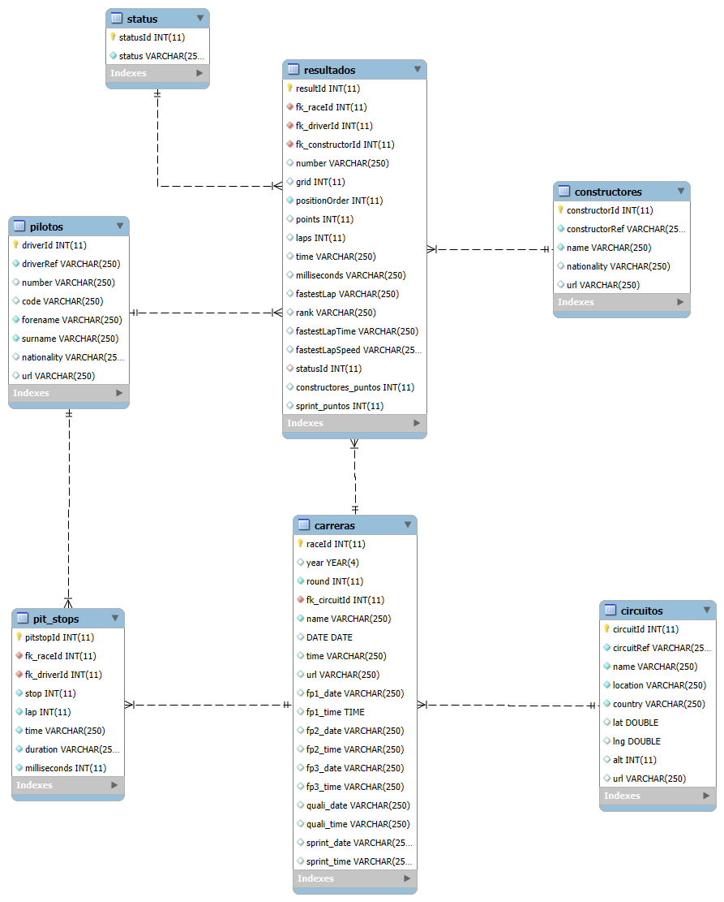

# Base de datos de F1

## Descripción
Este proyecto se realizó con la intención de aprender normalizacion de datos en formato .csv para luego cargarlos en un motor de base de datos, en este caso MariaDB y modificarlos en base a nuestra necesidad.

Con este objetivo en mente, elegimos un Dataset que contiene informacion sobre Formula 1 como los pilotos, escuderias, carreras, circuitos, tiempos y puntos ganados de 1950 hasta 2024.

El referido Dataset puede ser encontrado en el siguiente
[enlace](https://www.kaggle.com/datasets/rohanrao/formula-1-world-championship-1950-2020/data).


## Instalación

1. Cloná el siguiente repositorio:
  
    ```bash
    git clone https://github.com/eli-suligoy/F1history
    ```
2. Carga el script o archivo sql incluido en el repositorio en tu motor de base de datos de preferencia.


## Diagrama de Entidad - Relación
A continuación se adjunta el diagrama de Entidad Relación de la base de datos una vez finalizado el proyecto:



## Explicación sobre Normalización Realizada

1. Antes que nada, descargamos los archivos .csv y corroboramos como los datos estaban organizamos y que tipo de separador usaban para comenzar a planificar la estructura de la base de datos y las tablas.

2. Pasamos a crear la base de datos con la siguiente consulta
    ```sql
    CREATE DATABASE F1;
    ```
3. Pasamos a crear las tablas que iban a contener a los archivos .csv. Para ello usamos solo tipo de datos Integer y Varchar (250), y definimos claves primarias y foráneas. Creamos una tabla por cada archivo a importar.
    - Tabla Constructores
    ```sql
    CREATE TABLE constructores (
        constructorId INT NOT NULL PRIMARY KEY,
        constructorRef VARCHAR(250) NOT NULL,
        name VARCHAR(250) NOT NULL,
        nationality VARCHAR(250) NULL,
        url VARCHAR(250) NULL
    );
    ```
     - Tabla Circuitos
    ```sql
    CREATE TABLE circuitos (
        circuitId INT NOT NULL PRIMARY KEY,
        circuitRef VARCHAR(250) NOT NULL,
        name VARCHAR(250) NOT NULL,
        location VARCHAR(250) NOT NULL,
        country VARCHAR(250) NOT NULL,
        lat VARCHAR(250) NULL,
        lng VARCHAR(250) NULL,
        alt INT NULL,
        url VARCHAR(250) NULL
    );
    ```
     - Tabla Pilotos
    ```sql
    CREATE TABLE pilotos (
        driverId INT NOT NULL PRIMARY KEY,
        driverRef VARCHAR(250) NOT NULL,
        number VARCHAR(250) NULL,
        code VARCHAR(250) NULL,
        forename VARCHAR(250) NOT NULL,
        surname VARCHAR(250) NOT NULL,
        dob VARCHAR(250) NULL,
        nationality VARCHAR(250) NULL,
        url VARCHAR(250) NULL
    );
    ```
    - Tabla Status
    ```sql
    CREATE TABLE status (
        statusId INT NOT NULL PRIMARY KEY,
        status VARCHAR(250) NOT NULL,
    );
    ```
    - Tabla Constructor_Results (Tabla Temporal)
    ```sql
    CREATE TABLE constructor_results (
        constructorResultsId INT NOT NULL PRIMARY KEY,
        fk_raceId INT NOT NULL,
        fk_constructorId INT NOT NULL,
        points INT NULL,
        status VARCHAR (250) NULL,
        FOREIGN KEY fk_carrera_constresult (fk_raceId) REFERENCES carreras (raceId),
        FOREIGN KEY fk_construc_constresult (fk_constructorId) REFERENCES constructores (constructorId)
    );
    ```
    - Tabla Pit_Stops
    ```sql
    CREATE TABLE pit_stops (
        pitstopId INT NOT NULL AUTO_INCREMENT PRIMARY KEY,
        fk_raceId INT NOT NULL,
        fk_driverId INT NOT NULL,
        stop INT NOT NULL,
        lap INT NOT NULL,
        time VARCHAR(250) NOT NULL,
        duration VARCHAR(250) NOT NULL,
        milliseconds INT NOT NULL,
        CONSTRAINT fk_race_pilots FOREIGN KEY (fk_driverId) REFERENCES pilotos (driverId),
        CONSTRAINT fk_race_pit FOREIGN KEY (fk_raceId) REFERENCES carreras (raceId)
    );
    ```
    - Tabla Carreras
    ```sql
    CREATE TABLE carreras (
        raceId INT NOT NULL PRIMARY KEY,
        year INT NOT NULL,
        round INT NOT NULL,
        fk_circuitId INT NOT NULL,
        name VARCHAR(250) NOT NULL,
        date VARCHAR(250) NOT NULL,
        time VARCHAR(250) NULL,
        url VARCHAR(250) NULL,
        fp1_date VARCHAR(250) NULL,
        fp1_time VARCHAR(250) NULL,
        fp2_date VARCHAR(250) NULL,
        fp2_time VARCHAR(250) NULL,
        fp3_date VARCHAR(250) NULL,
        fp3_time VARCHAR(250) NULL,
        quali_date VARCHAR(250) NULL,
        quali_time VARCHAR(250) NULL,
        sprint_date VARCHAR(250) NULL,
        sprint_time VARCHAR(250) NULL,
        FOREIGN KEY fk_circuito_carrera (fk_circuitId) REFERENCES circuitos (circuitId)
    );
    ```

    - Tabla Sprint_Resultados (Tabla Temporal)
    ```sql
    CREATE TABLE sprint_resultados (
        resultId INT NOT NULL PRIMARY KEY,
        fk_raceId INT NOT NULL,
        fk_driverId INT NOT NULL,
        fk_constructorId INT NOT NULL,
        number INT NOT NULL,
        grid INT NULL,
        position VARCHAR(250) NULL,
        positionText VARCHAR(250) NOT NULL,
        positionOrder INT NOT NULL,
        points INT NULL,
        laps INT NULL,
        time VARCHAR(250) NULL,
        milliseconds VARCHAR(250) NULL,
        fastestLap VARCHAR(250) NULL,
        fastestLapTime VARCHAR(250) NULL,
        statusId INT NULL,
        FOREIGN KEY fk_piloto_sprint (fk_driverId) REFERENCES pilotos (driverId),
        FOREIGN KEY fk_carrera_sprint (fk_raceId) REFERENCES carrera (raceId)
        FOREIGN KEY fk_construc_sprint (fk_constructorId) REFERENCES constructores (constructorId)
    );
    ```


    - Tabla Resultados
    ```sql
    CREATE TABLE resultados (
        resultId INT NOT NULL PRIMARY KEY,
        fk_raceId INT NOT NULL,
        fk_driverId INT NOT NULL,
        fk_constructorId INT NOT NULL,
        number VARCHAR(250) NULL,
        grid INT NULL,
        position VARCHAR(250) NULL,
        positionText VARCHAR(250) NOT NULL,
        positionOrder INT NOT NULL,
        points INT NULL,
        laps INT NULL,
        time VARCHAR(250) NULL,
        milliseconds VARCHAR(250) NULL,
        fastestLap VARCHAR(250) NULL,
        rank VARCHAR(250) NULL,
        fastestLapTime VARCHAR(250) NULL,
        fastestLapSpeed VARCHAR(250) NULL,
        statusId INT NULL,
        FOREIGN KEY fk_piloto_result (fk_driverId) REFERENCES pilotos (driverId),
        FOREIGN KEY fk_carrera_result (fk_raceId) REFERENCES carrera (raceId)
        FOREIGN KEY fk_construc_result (fk_constructorId) REFERENCES constructores (constructorId)
    );
    ```
4. A partir de ahí comenzamos cargando los datos a la base con el siguiente comando:
    ```sql
        LOAD DATA INFILE 'C:\\ruta\\drivers.csv' 
        INTO TABLE pilotos
        FIELDS TERMINATED BY ';'
        LINES TERMINATED BY '\n'
        IGNORE 1 ROWS;
    ```
    Para evitar repetición, solo incluímos ese comando ya que lo unico que cambia es la ruta del archivo y el nombre de la tabla.

5. Una vez con todos los datos cargados, identificamos que habia tres tablas "resultados" que se podian unir en una misma, por lo tanto, comenzamos agregando dos columnas a la tabla "resultados", una llamada "" y otra llamada "":

    ```sql
    ALTER TABLE resultados ADD COLUMN constructores_puntos INT;
    ALTER TABLE resultados ADD COLUMN sprint_puntos INT;
    ```

6. Después, usando los siguientes comandos, pasamos los datos de la tabla "sprint_resultados" y "constructor_results" a "resultados":
    ```sql
    UPDATE resultados r, sprint_resultados sr
    SET r.sprint_puntos=sr.points
    WHERE sr.fk_raceId=r.fk_raceId
    AND sr.fk_driverId=r.fk_driverId
    AND sr.fk_constructorId=r.fk_constructorId;
    ```
    ```sql
    UPDATE resultados r
    JOIN constructor_results cr
    ON r.fk_raceId=cr.fk_raceId AND r.fk_constructorId=cr.fk_constructorId
    SET r.constructores_puntos=cr.points;
    ```
7. Para finalizar, borramos las dos tablas extras de resultados:
    ```sql
    DROP TABLE sprint_resultados;
    DROP TABLE constructor_resultados;
    ```
8. Una vez que teniamos todos los datos donde queriamos, comenzamos a editar los tipos de datos. Primero que nada agregamos una llave foránea que nos habiamos salteado.
    ```sql
    ALTER TABLE resultados ADD CONSTRAINT fk_result_status 
    FOREIGN KEY (statusId) REFERENCES status (statusId);
    ```
    ```sql
    ALTER TABLE circuitos MODIFY lat DOUBLE;
    ALTER TABLE circuitos MODIFY lng DOUBLE;
    ALTER TABLE carreras MODIFY year YEAR;
    ```
9. En algunas columnas teniamos valores "\N", que significa salto de línea, y queriamos reemplazarlos con "null". Para ello tuvimos que usar la siguiente consulta donde le tuvimos que indicar el valor pero en hexadecimal: 
    ```sql
    UPDATE carreras
    SET fp1_date = NULL
    WHERE HEX(fp1_date) = '5C4E';
    ```
10. A partir de aquí escribimos las consultas que queríamos realizar (se encuentran en el siguiente apartado) y creamos las vistas que pensamos podrían sernos útiles más adelante con el siguiente comando:
    ```sql
    CREATE VIEW vista AS SELECT...
    ```

## Consultas
A continuación se muestran las consultas SQL que realizamos con la base de datos, algunas de las cuales ademas creamos como vistas.


- Cantidad de pilotos de Argentinos que corrieron en la F1
```sql
SELECT COUNT(*)
FROM pilotos p
WHERE p.nationality = "argentine";
```


- Lista de Pilotos Argentinos, su mejor resultado conseguido y con que Escuderia
```sql
SELECT CONCAT (forename, ' ', surname) AS Piloto, p.nationality AS Nacionalidad, MIN(r.positionOrder) as Mejor_Puesto, c.`name` AS Escuderia
FROM pilotos p, resultados r, constructores c
WHERE p.nationality = "argentine"
AND r.fk_driverId = p.driverId
AND r.fk_constructorId = c.constructorId
GROUP BY piloto;
```


- Cantidad de carreras de F1 que corrió Fangio
```sql
SELECT COUNT(*)
from resultados c
WHERE c.fk_driverId = 579;
```


- Cantidad de podios conseguidos por Fangio
```sql
SELECT COUNT(*)
from resultados c
WHERE c.fk_driverId = 579 
AND (c.positionOrder = 1 OR c.positionOrder = 2 OR c.positionOrder=3);
```


- Listado de todos los resultados conseguidos por Fangio, con su respectiva fecha, posición conseguida, el estado en el cual terminó el monoplaza, la escuderia con la cual corrió esa carrera y el circuito y país donde ocurrió
```sql
SELECT CONCAT (p.forename, ' ', p.surname) AS Piloto, c.DATE AS Fecha, r.positionOrder AS Posicion, s.`status` as Estado, e.`name` AS Escuderia,
CONCAT (ci.`name`, ' - ', ci.location) AS Circuito, ci.country AS Pais
from resultados r, pilotos p, carreras c, constructores e, circuitos ci, status s
WHERE r.fk_driverId = 579
AND r.fk_driverId=p.driverId AND r.fk_raceId=c.raceId AND r.fk_constructorId=e.constructorId AND c.fk_circuitId=ci.circuitId
AND r.statusId=s.statusId
ORDER BY fecha;
```


- Escuderías en las cuales corrió Fangio
```sql
SELECT CONCAT (p.forename, ' ', p.surname) AS Piloto, c.`name` AS Escuderia
from resultados r, pilotos p, constructores c 
WHERE r.fk_driverId = 579 AND r.fk_driverId=p.driverId AND r.fk_constructorId=c.constructorId
GROUP BY escuderia;
```

- Todas las carreras corridas en Argentina, con su fecha, y el ganador
```sql
SELECT CONCAT (ci.`name`, ' - ', ci.location) AS Circuito, ca.DATE AS Fecha, CONCAT (p.forename, ' ', p.surname) AS Piloto
FROM  carreras ca, circuitos ci, resultados r, pilotos p
WHERE ci.country = 'Argentina' AND r.positionOrder=1
AND ca.fk_circuitId=ci.circuitId AND r.fk_raceId=ca.raceId AND r.fk_driverId=p.driverId
ORDER BY fecha;
```

- Datos generales de Pilotos Legendarios:
    - Lewis Hamilton:
    ```sql
    SELECT CONCAT (p.forename, ' ', p.surname) AS Piloto, c.DATE AS Fecha, r.positionOrder AS Posicion, s.`status` as Estado, e.`name` AS Escuderia, 
    CONCAT (ci.`name`, ' - ', ci.location) AS Circuito, ci.country AS Pais
    from resultados r, pilotos p, carreras c, constructores e, circuitos ci, status s
    WHERE r.fk_driverId = 1 
    AND r.fk_driverId=p.driverId AND r.fk_raceId=c.raceId AND r.fk_constructorId=e.constructorId AND c.fk_circuitId=ci.circuitId
    AND r.statusId=s.statusId
    ORDER BY fecha;
    ```

    - Max Verstappen
    ```sql
    SELECT CONCAT (p.forename, ' ', p.surname) AS Piloto, c.DATE AS Fecha, r.positionOrder AS Posicion, s.`status` as Estado, e.`name` AS Escuderia, 
    CONCAT (ci.`name`, ' - ', ci.location) AS Circuito, ci.country AS Pais
    from resultados r, pilotos p, carreras c, constructores e, circuitos ci, status s
    WHERE r.fk_driverId = 830 
    AND r.fk_driverId=p.driverId AND r.fk_raceId=c.raceId AND r.fk_constructorId=e.constructorId AND c.fk_circuitId=ci.circuitId
    AND r.statusId=s.statusId
    ORDER BY fecha;
    ```

    - Michael Schumacher
    ```sql
    SELECT CONCAT (p.forename, ' ', p.surname) AS Piloto, c.DATE AS Fecha, r.positionOrder AS Posicion, s.`status` as Estado, e.`name` AS Escuderia, 
    CONCAT (ci.`name`, ' - ', ci.location) AS Circuito, ci.country AS Pais
    from resultados r, pilotos p, carreras c, constructores e, circuitos ci, status s
    WHERE r.fk_driverId = 30 
    AND r.fk_driverId=p.driverId AND r.fk_raceId=c.raceId AND r.fk_constructorId=e.constructorId AND c.fk_circuitId=ci.circuitId
    AND r.statusId=s.statusId
    ORDER BY fecha;
    ```

    - Ayrton Senna
    ```sql
    SELECT CONCAT (p.forename, ' ', p.surname) AS Piloto, c.DATE AS Fecha, r.positionOrder AS Posicion, s.`status` as Estado, e.`name` AS Escuderia, 
    CONCAT (ci.`name`, ' - ', ci.location) AS Circuito, ci.country AS Pais
    from resultados r, pilotos p, carreras c, constructores e, circuitos ci, status s
    WHERE r.fk_driverId = 102 
    AND r.fk_driverId=p.driverId AND r.fk_raceId=c.raceId AND r.fk_constructorId=e.constructorId AND c.fk_circuitId=ci.circuitId
    AND r.statusId=s.statusId
    ORDER BY fecha;
    ```

- Promedio por piloto de la temporada 2023 de paradas en boxes, medido en milisegundos
```sql
SELECT CONCAT (p.forename, ' ', p.surname) AS Piloto, ROUND(AVG(ps.milliseconds),1) AS Promedio
FROM pit_stops ps, pilotos p, carreras c
WHERE c.`year`=2023
AND ps.fk_raceId=c.raceId AND ps.fk_driverId=p.driverId
GROUP BY p.driverId
ORDER BY Promedio;
```

## Creadores
Este trabajo fué realizado por Gregoret, Lautaro y Suligoy, Eliana.
